# Predicting Seasonal Flu Vaccination Status

# Overview

The goal of this project is to predict how likely individuals are to receive their flu vaccines. Specifically, we’ll be predicting for the `seasonal_vaccine` target variable. An understanding of how people’s backgrounds, opinions, and health behaviors can provide guidance for future public health efforts and how they are related to their personal vaccination patterns.

# Business Understanding

The aim of this project is to predict whether individuals received the seasonal flu vaccine using data obtained from [DrivenData](https://www.drivendata.org/competitions/66/flu-shot-learning/page/211/). By understanding the factors that influence vaccine uptake, public health efforts can be better tailored by the Ministry of Health in Kenya, to increase vaccination rates and protect the population against influenza. Other benefits from this analysis include:

- Public Health Campaigns: Insights from this analysis can guide the development of targeted public health campaigns to promote flu vaccination, addressing specific concerns or barriers identified among different population segments.
- Resource Allocation: Understanding the demographic or socio-economic factors associated with vaccine uptake can help allocate resources effectively, ensuring that vulnerable populations receive adequate access to flu vaccines.
- Policy Recommendations: Findings from the analysis can inform policymakers on the need for specific policies or interventions to increase flu vaccination rates, such as workplace vaccination programs or community outreach initiatives.

### Business Objectives:

1. To determine the key factors that influence an individual's decision to get vaccinated for the seasonal flu.

2. To determine how preventive measures impact an individual's decision to get vaccinated.

3. To develop a robust predictive model that accurately estimates the probability of individuals receiving their seasonal flu vaccines.

# Data Understanding

Data files were obtained from [DrivenData](https://www.drivendata.org/competitions/66/flu-shot-learning/page/211/)

- The records/rows contain the results of a survey conducted in 2009 which collected some basic demograpahic information as well as information specific to an individual's risk of developing flu-related complications, for instance, having a chronic medical condition, the level of concern/knowledge about the flu, and also some behavioral attributes like buying a face mask and avoiding close contact with people with flu-like symptoms.
- Labels are binary variables, with **1** indicating that a person **received** the respective flu vaccine and **0** indicating that a person **did not receive** the respective flu vaccine.
- Majority of data is categorical (binary).

# Data Description
- h1n1_concern - Level of concern about the H1N1 flu.
 - 0 = Not at all concerned; 1 = Not very concerned; 2 = Somewhat concerned; 3 = Very concerned.
- h1n1_knowledge - Level of knowledge about H1N1 flu.
 - 0 = No knowledge; 1 = A little knowledge; 2 = A lot of knowledge.
- behavioral_antiviral_meds - Has taken antiviral medications. (binary)
- behavioral_avoidance - Has avoided close contact with others with flu-like symptoms. (binary)
- behavioral_face_mask - Has bought a face mask. (binary)
- behavioral_wash_hands - Has frequently washed hands or used hand sanitizer. (binary)
- behavioral_large_gatherings - Has reduced time at large gatherings. (binary)
- behavioral_outside_home - Has reduced contact with people outside of own household. (binary)
- behavioral_touch_face - Has avoided touching eyes, nose, or mouth. (binary)
- doctor_recc_h1n1 - H1N1 flu vaccine was recommended by doctor. (binary)
- doctor_recc_seasonal - Seasonal flu vaccine was recommended by doctor. (binary)
- chronic_med_condition - Has any of the following chronic medical conditions: asthma or an other lung condition, diabetes, a heart condition, a kidney condition, sickle cell anemia or other anemia, a neurological or neuromuscular condition, a liver condition, or a weakened immune system caused by a chronic illness or by medicines taken for a chronic illness. (binary)
- child_under_6_months - Has regular close contact with a child under the age of six months. (binary)
- health_worker - Is a healthcare worker. (binary)
- health_insurance - Has health insurance. (binary)
- opinion_h1n1_vacc_effective - Respondent's opinion about H1N1 vaccine effectiveness.
 - 1 = Not at all effective; 2 = Not very effective; 3 = Don't know; 4 = Somewhat effective; 5 = Very effective.
- opinion_h1n1_risk - Respondent's opinion about risk of getting sick with H1N1 flu without vaccine.
 - 1 = Very Low; 2 = Somewhat low; 3 = Don't know; 4 = Somewhat high; 5 = Very high.
- opinion_h1n1_sick_from_vacc - Respondent's worry of getting sick from taking H1N1 vaccine.
 - 1 = Not at all worried; 2 = Not very worried; 3 = Don't know; 4 = Somewhat worried; 5 = Very worried.
- opinion_seas_vacc_effective - Respondent's opinion about seasonal flu vaccine effectiveness.
 - 1 = Not at all effective; 2 = Not very effective; 3 = Don't know; 4 = Somewhat effective; 5 = Very effective.
- opinion_seas_risk - Respondent's opinion about risk of getting sick with seasonal flu without vaccine.
 - 1 = Very Low; 2 = Somewhat low; 3 = Don't know; 4 = Somewhat high; 5 = Very high.
- opinion_seas_sick_from_vacc - Respondent's worry of getting sick from taking seasonal flu vaccine.
 - 1 = Not at all worried; 2 = Not very worried; 3 = Don't know; 4 = Somewhat worried; 5 = Very worried.
- age_group - Age group of respondent.
- education - Self-reported education level.
- race - Race of respondent.
- sex - Sex of respondent.
- income_poverty - Household annual income of respondent with respect to 2008 Census poverty thresholds.
- marital_status - Marital status of respondent.
- rent_or_own - Housing situation of respondent.
- employment_status - Employment status of respondent.
- hhs_geo_region - Respondent's residence using a 10-region geographic classification defined by the U.S. Dept. of Health and Human Services. Values are represented as short random character strings.
- census_msa - Respondent's residence within metropolitan statistical areas (MSA) as defined by the U.S. Census.
- household_adults - Number of other adults in household, top-coded to 3.
- household_children - Number of children in household, top-coded to 3.
- employment_industry - Type of industry respondent is employed in. Values are represented as short random character strings.
- employment_occupation - Type of occupation of respondent. Values are represented as short random character strings.

# Metric of Success

Our metric of success, which we will be optimizing for, is the **ROC-AUC** score (Receiver Operating Characteristic - Area Under the Curve). 

The ROC-AUC score allows us to analyze the trade-off between sensitivity (true positive rate) and specificity (true negative rate) at different classification thresholds.

By examining the ROC curve and choosing an appropriate threshold, we can balance the prediction of true positives (correctly identifying those who will uptake the vaccine) and true negatives (correctly identifying those who will not uptake the vaccine), which is crucial in healthcare planning, decision-making and targeted interventions.

# Exploratory Data Analysis

In this section, we will examine the relationship between the variables using univariate, bivariate and multivariate analysis.

## Univariate Analysis

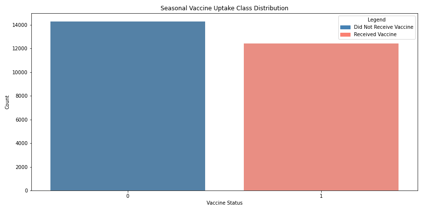

#### *Inference*

From the above plot, approximately 14,000 people did not receive the seasonal flu vaccine, compared to approximately 12,000 people who received the vaccine.

## Bivariate Analysis

Here we are checking for the relationship between various features and our target variable `seasonal_vaccine`.

### i) Doctor's Recommendation

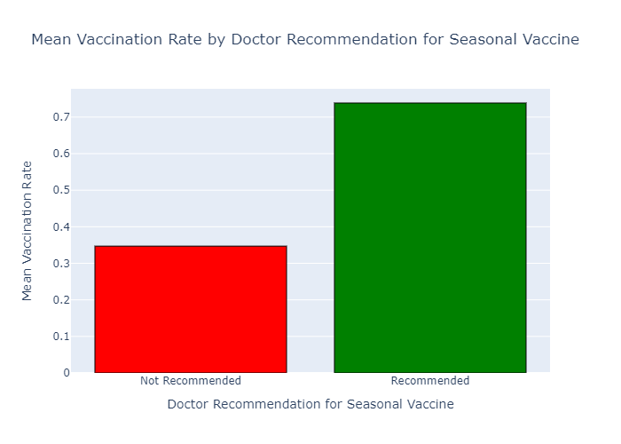

This is the most important predictive feature, i.e. having a doctor recommend getting the flu vaccine. 

From the graph, people who had their doctors recommend to them the vaccine, had a mean vaccination rate of 74% and hence were substantially more likely to have gotten vaccinated.

### ii) Respondent's opinion about seasonal flu vaccine effectiveness.

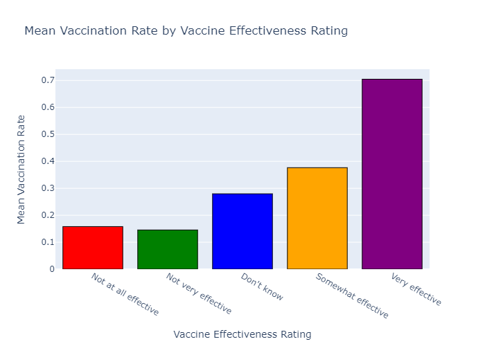

From the graph, people that rate the vaccine as 5 (Very Effective) have a mean vaccination rate of 70% and hence are more likely to have gotten the vaccine as compared to the other respondents. 

### iii) Health Worker

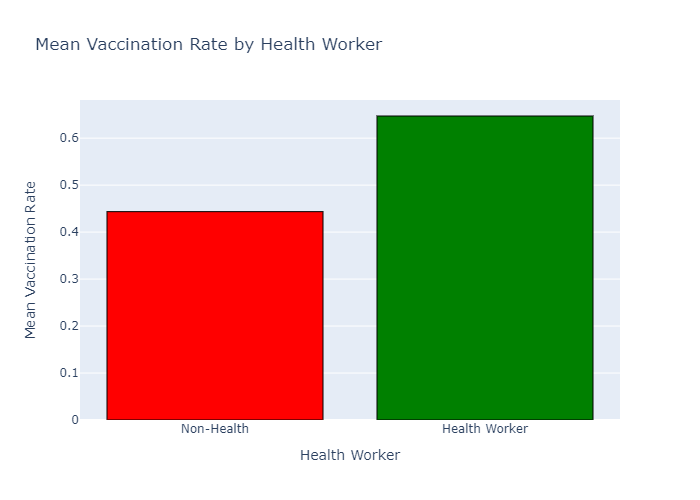

From the graph, Health workers had a higher mean vaccination rate of 65% as compared to Non-Health workers whose rate was 45%.

Health workers are more likely to get the flu vaccine than the rest of the population. Individuals in these professions are also more likely to be well informed about the risks and benefits of vaccination and potential dangers of contracting the seasonal flu.

### iv) Health Insurance

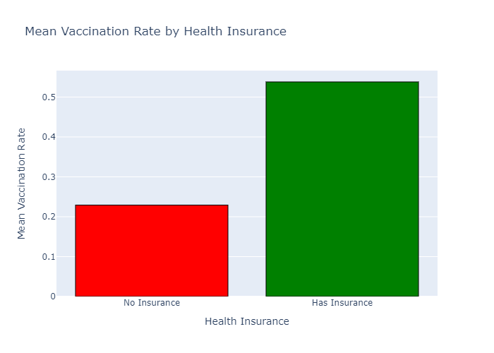

From the graph, People with insurance had a higher mean vaccination rate of 54% as compared to 23% for people with no insurance.

People with health insurance are more likely to have gotten the vaccine whereas people without health insurance were very unlikely to have gotten the vaccine. This may be because individuals without health insurance are less likely to see a doctor very often, so they may not have the vaccine recommended to them by a doctor (a top predictor), and they may also be less informed about the effectiveness and safety of the vaccine.

### v) Perceived Risk of Getting Sick from Flu Vaccine

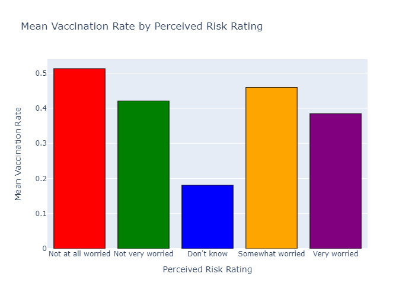

Here a higher rating means the individual is more concerned about getting sick from the flu vaccine itself. 

People are more likely to get the vaccine if they are less worried about side effects. 

From the graph, people with a perceived risk rating of 1 (Not at all worried) had the highest mean vaccination rate at 51%.

### vi) Income Level

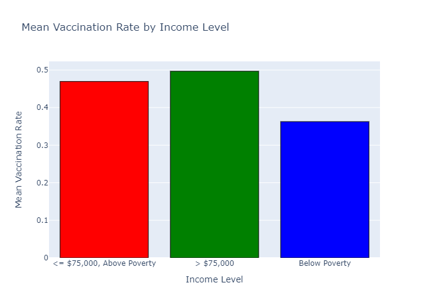

This is in reference to the household annual income of respondents with respect to 2008 Census poverty thresholds.

From the graph, individuals living with a household income below the 2008 Census poverty threshold are less likely to get the vaccine with a mean vaccination rate of 36%, as compared to the other income categories.

### vii) Race

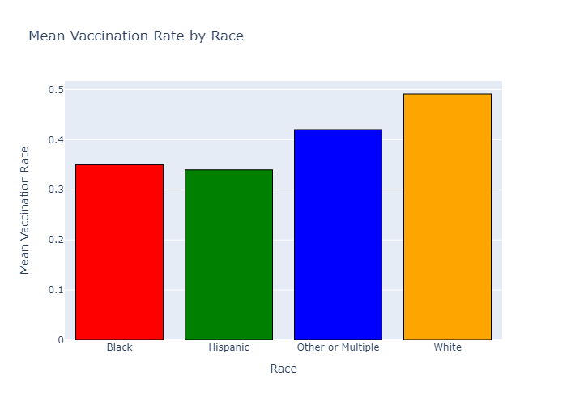

From the graph, the mean vaccination rates is fairly distributed amongst the different races, with White people being the highest likely to get vaccinated (a mean vaccination rate of 49%), while Hispanic people having the lowest vaccination rate at 34%.

### viii) Chronic Medical Condition

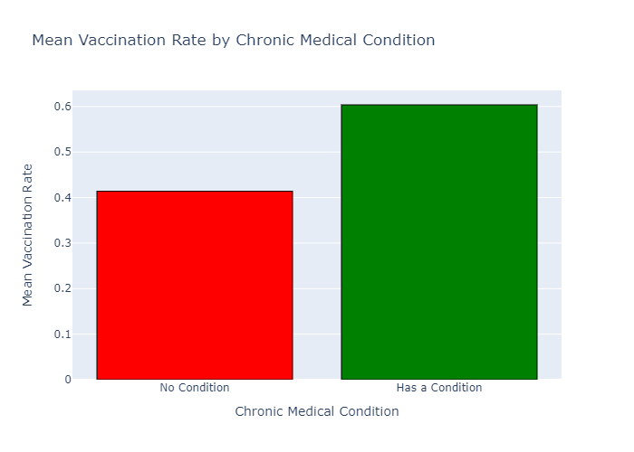

From the graph, people with a chronic medical condition such as asthma or any other lung condition, diabetes, a heart condition or a weakened immune system, are highly likely to get vaccinated, with a mean vaccination rate of 60%, as compared to people with no chronic medical condition who have a vaccine uptake rate of 42%.

### ix) Behavior (touching face)

.png)

From the graph, people who have avoided touching their face(eyes, nose, or mouth) have a higher mean vaccination rate of 51%.

This could be due to the fact that they want to combine all the efforts at their disposal in preventing contracting the flu.

### x) Education

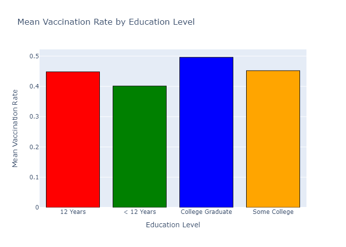

The proportion of people vaccinated within each level of education category increases with increasing level of education. 

As we can see from the graph, college graduates had the highest mean vaccination rate at 51%.

# Feature Engineering

### i) `behavior_score`

- Create a variable that represents how much an individual has done behaviorally to avoid the flu, aside from getting vaccinated, by summing up all behavioral variables. These are all binary columns with **1** representing **YES**, meaning the person has engaged in a behavior that reduces the risk of contracting the flu. By taking the sum across these columns, a higher score represents a more cautious, flu-conscious individual.

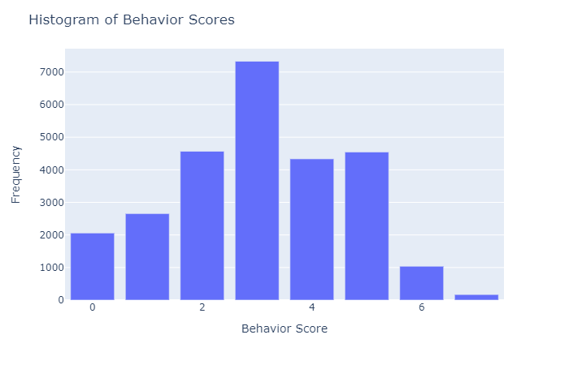

#### *Inference*

From the above bar plot, we can denote that:
- The majority, that is, 7331 individuals have practised at least 3 of the 7 behavioral attributes.
- The minority, that is, only 171 individuals have practised all the 7 behavioral attributes in a bid to minimize flu contractions.

### ii) `risk_overall`

- Create a variable that represents an individual's overall risk for developing flu-related complications. Some individuals are naturally at higher risk of developing complications. This includes people working in the healthcare industry, people 65 years and older, children 6 months or younger, and people with chronic medical conditions such as lung conditions, diabetes and heart conditions.

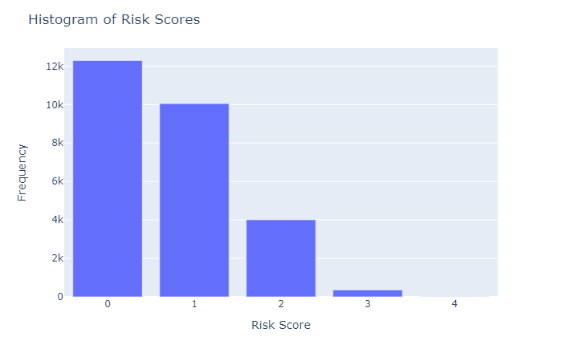

#### *Inference*

The risk score provides a numerical representation of the risk level for each individual based on the conditions considered. Higher risk scores indicate a higher risk level.
- 0 risk score: There are 12,286 rows in the DataFrame with a risk score of 0. These are likely individuals who do not meet any of the conditions considered in the calc_risk_score function.
- 1 risk score: There are 10,048 rows in the DataFrame with a risk score of 1. These individuals likely meet one of the conditions considered in the function.
- 2 risk score: There are 4,007 rows in the DataFrame with a risk score of 2. These individuals likely meet two of the conditions.
- 3 risk score: There are 356 rows in the DataFrame with a risk score of 3. These individuals likely meet three of the conditions.
- 4 risk score: There are 10 rows in the DataFrame with a risk score of 4. These individuals likely meet all four conditions.

### iii) `risk_category`

- Create a variable that bins individuals into either low-risk, medium-risk or high-risk categories based on their risk-score.

# MODELING

## Defining a Function for Modeling

- Define a function and wrap our whole modeling process into a pipeline. This approach allows us to reuse the function for various classifiers by simply passing the appropriate data and `model` object.
- The function also takes in an argument `param_grid`, which when specified, it will perform a grid-search and hence hyperparameter tuning to see if the given model will have a performance improvement compared to when using the default parameters.
- For XGBoost and Random Forest, the function will extract the important features, and plot them, as well as plot the ROC-AUC curve.
- This will help to reduce redundancy and makes our code more modular and organized.

## Data Preprocessing before model training

- The function also contains data preprocessing techniques such as: 
 - Imputing Missing Values
 - One Hot Encoding of Categorical variables
 - Ordinal Encoding of ordinal variables, such as `age_group`, `education` and `income_poverty`.
 - Standardization/Normalization for models such as Logistic Regression and K-Nearest Neighbors, while if a non-parametric model is passed in the function, you can specify whether to scale or not.
 
 - In a bid to prevent **data leakage**, we do the preprocessing and transformations by fitting and transforming our functions on the training data, then just transforming on the test data.
 
## Baseline Model (Logistic Regression)

Train ROC AUC Score: 0.776
Test ROC AUC Score: 0.780

The baseline Logistic Regression model appears to be performing good.

With a Train ROC AUC Score of 0.78 and a Test ROC AUC Score of 0.78. 

This shows there are no instances of overfitting or underfitting, which can be attributed to the fact that Logistic Regression has regularization built into it, hence minimizing any chances of overfitting.

Also, the Area Under Curve is 0.85, denoting a good performance by the model.

## Hyperparameter Tuning for the baseline Logistic Regression model

Here we will use the `GridSearchCV` function to tune the main parameters for Logistic Regression.

Best Hyperparameters: {'C': 0.1, 'penalty': 'l2', 'solver': 'liblinear'}
Best ROC-AUC Score: 0.849
Best Estimator: LogisticRegression(C=0.1, random_state=110, solver='liblinear')
Train ROC AUC Score: 0.776
Test ROC AUC Score: 0.779
 
- For the baseline Logistic Regression model, performing a GridSearch for the best hyperparameter combination resulted in a very small improvement of the metrics.

- Our metric for optimization --> **Best ROC-AUC Score: 0.8495**

- So we will try another model, Decision Tree, which has a couple of advantages over the Logistic Regression model:
 - **No Assumptions about Data Distribution:** Decision trees are capable of capturing nonlinear relationships between features and the target variable. They can handle complex interactions and decision boundaries without the need for explicit feature engineering or transformations.
 - **Feature Importance:** Decision trees can provide information about feature importance. By examining the splits in the tree and the resulting impurity or information gain, we can identify which features are most relevant for prediction. This can help in feature selection and understanding the underlying factors driving the predictions.
 
 
## Iteration 1: Decision Tree

Train ROC AUC Score: 0.999
Test ROC AUC Score: 0.686

- From the above performance metrics, we can denote **overfitting**. This is because for the training set, all the metrics have a perfect score of **100%**, while for the test set the metrics have a score of between **65-69%**. This means that the model has learned the training data too well hence is not able to generalize to new unseen dataset, and hence the poor performance on the test set.

- Also, the Train ROC AUC Score is 0.999, while the Test ROC AUC Score is 0.687, further denoting the overfitting.

- Therefore we will need to tune the parameters to minimize the overfitting.

## Hyperparameter Tuning for our Decision Tree model

Best Hyperparameters: {'criterion': 'entropy', 'max_depth': 5, 'min_samples_leaf': 1, 'min_samples_split': 2}
Best ROC-AUC Score: 0.825
Best Estimator: DecisionTreeClassifier(criterion='entropy', max_depth=5, random_state=10)
Train ROC AUC Score: 0.748
Test ROC AUC Score: 0.749

- After hyperparameter tuning, our Decision Tree model really improved in terms of reducing the overfitting. The metrics for the test set have also improved, meaning the model is more able to generalize to new unseen dataset.

- The Area Under Curve also has really improved, from 0.69 for the model with default parameters, all the way upto 0.83 for the tuned model.

- Our metric for optimization --> **Best ROC-AUC Score: 0.8256**

- Next we will try another model, K-Nearest Neighbors, which has some advantages over the Decision Tree model:
 - KNN does not involve an explicit training phase: The algorithm simply stores the training data in memory, making the training process fast and memory-efficient. This can be advantageous in situations where training time is a critical factor.
 - Effective with high-dimensional data: KNN can perform well with high-dimensional data because it does not rely on assumptions about the feature space. It considers the distances between data points, which can still be meaningful in high-dimensional spaces. 
 
 
## Iteration 2: K-Nearest Neighbors 

Train ROC AUC Score: 0.810
Test ROC AUC Score: 0.727

From the above performance metrics, we can denote some overfitting. This is because there is some considerable deviation between the training metric performance and the test metric performance.

For instance, the Train ROC AUC Score is 0.81, while the Test ROC AUC Score: 0.73

This means that the model is not able to generalize well to new unseen dataset, and hence the somewhat poor performance on the test set.

Therefore, we need to tune our parameters.

## Hyperparameter Tuning for our K-NN model

Best Hyperparameters: {'n_neighbors': 9, 'p': 1, 'weights': 'distance'}
Best ROC-AUC Score: 0.808
Best Estimator: KNeighborsClassifier(n_jobs=3, n_neighbors=9, p=1, weights='distance')
Train ROC AUC Score: 0.999
Test ROC AUC Score: 0.748

After hyperparameter tuning, there was some serious overfitting. For instance, the Train ROC AUC Score is 0.99, while the Test ROC AUC Score is 0.75

This simply means that the model is not able to generalize well to new data.

Our metric for optimization --> **Best ROC-AUC Score: 0.8085**

- Surprisingly, the KNN model has a worse ROC-AUC score compared to our Decision Tree, despite being a more complex model. This could be due to factors such as:
 - The nature of our dataset, eg. Non-linear relationships: Decision trees can effectively capture non-linear relationships between features and the target variable. They can create complex decision boundaries that are not limited to a fixed number of neighbors. In situations where the decision boundary is highly non-linear, decision trees may outperform KNN.
 
- Also, the high dimensionality of the feature space was impacting the computational cost of K-NN in terms of the training time. As the number of features increases, the distance calculations between instances become more computationally expensive.

- Next we will try another model, Random Forest, which has some advantages over the Decision Tree and K-NN models:
 - Random Forest is an ensemble method that combines multiple decision trees to make predictions. 
 - They can handle complex relationships and interactions between features, and it is more effective at capturing non-linear patterns in the data.
 - It reduces the risk of overfitting compared to a single decision tree by averaging predictions from multiple trees and using random subsets of features.
 - Random Forest provides feature importance measures, which can be helpful for understanding the importance of different features in the model.
 
## Iteration 3: Random Forest 

Train ROC AUC Score: 0.999
Test ROC AUC Score: 0.768

- From the above performance metrics, we can denote overfitting. This is because for the training set, all the metrics have a perfect score of **100%**, while for the test set the metrics have a score of between **70-79%**. This means that the model has learned the training data too well hence is not able to generalize to new unseen dataset, and hence the poor performance on the test set.

- We can therefore perform some tuning of the parameters to improve on the model performance.

## Hyperparameter Tuning for our Random Forest model

Best Hyperparameters: {'max_depth': 10, 'max_features': 'auto', 'min_samples_leaf': 2, 'min_samples_split': 6, 'n_estimators': 500}
Best ROC-AUC Score: 0.850
Best Estimator: RandomForestClassifier(max_depth=10, min_samples_leaf=2, min_samples_split=6,
                       n_estimators=500, n_jobs=3, random_state=30)
Train ROC AUC Score: 0.800
Test ROC AUC Score: 0.776

After hyperparameter tuning, the test metrics improved by a bit. For instance, the test ROC-AUC score previously was 77%, and it improved up to 78%.

Our metric for optimization --> **Best ROC-AUC Score: 0.8507**

Next we will try another model, XGBoost, which has some advantages over the Random Forest model:
 - Improved Performance: It leverages the boosting technique, which combines multiple weak models sequentially to create a strong predictive model.
 - Regularization techniques, such as L1 and L2 regularization, to prevent overfitting.
 - Speed and Scalability: XGBoost is generally faster and more computationally efficient than Random Forest, especially when dealing with large datasets. It is designed to handle parallel processing, which enables efficient training on multi-core CPUs and distributed environments.
 
## Iteration 4: XGBoost

Train ROC AUC Score: 0.854
Test ROC AUC Score: 0.775

From the above performance metrics, we can denote some small overfitting. This is because there is some considerable deviation between the training metric performance and the test metric performance.

For instance; 
Train ROC AUC Score is 0.85, while
Test ROC AUC Score is 0.77

We therefore try to improve these metrics by tuning the parameters.

## Hyperparameter Tuning for XGBoost

Best Hyperparameters: {'colsample_bytree': 0.8, 'learning_rate': 0.1, 'max_depth': 5, 'n_estimators': 100, 'subsample': 0.8}
Best ROC-AUC Score: 0.854
Best Estimator: XGBClassifier(base_score=0.5, booster='gbtree', colsample_bylevel=1,
              colsample_bynode=1, colsample_bytree=0.8, gamma=0, gpu_id=-1,
              importance_type='gain', interaction_constraints='',
              learning_rate=0.1, max_delta_step=0, max_depth=5,
              min_child_weight=1, missing=nan, monotone_constraints='()',
              n_estimators=100, n_jobs=3, num_parallel_tree=1, random_state=40,
              reg_alpha=0, reg_lambda=1, scale_pos_weight=1, subsample=0.8,
              tree_method='exact', validate_parameters=1, verbosity=None)
Train ROC AUC Score: 0.803
Test ROC AUC Score: 0.786

After hyperparameter tuning, the test metrics improved by a bit. 

For instance:
Train ROC AUC Score is 0.80, while the
Test ROC AUC Score is 0.79.

Ideally you want to have your train and test metrics at par, which signifies that the model is able to generalize to new unseen data.

From the GridSearch cross-validation of 3 folds;
- Our metric for optimization --> **Best ROC-AUC Score is 0.8548**

### Summary of all the tuned models in terms of ROC-AUC Score:

1. Baseline Logistic Regression - 0.8495
2. Decision Tree - 0.8256
3. KNN - 0.8085
4. Random Forest - 0.8507 
5. XGBoost - 0.8548

- XGBoost is therefore our **best and final model** with the best ROC-AUC score of **0.8548**, as compared to all other models.

# Conclusions

### 1.  Features that were the most important in predicting vaccination status include:

1. `doctor_recc_seasonal`
2. `opinion_seas_vacc_effective`
3. `health_worker`
4. `health_insurance`
5. `opinion_seas_sick_from_vacc`
6. `income_poverty`
7. `education`
8. `race`
9. `chronic_med_condition`
10. `behavioral_touch_face`

### 2. How behavioral preventive measures impact vaccine uptake

Overall, the `behavior_score` variable provides a quantitative representation of individuals' engagement in flu-preventive behaviors/measures. The majority of individuals demonstrate a moderate to high level of caution, as indicated by their behavior scores. The distribution of scores highlights the variability in behavior across the population, with some individuals exhibiting lower levels of engagement and others being more proactive in flu prevention.

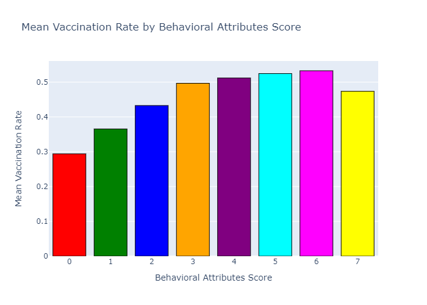

From the graph, people who engage in at least 6 out of the 7 preventive measures have a mean vaccination rate of 53%.

### 3. The best model for predicting vaccine uptake

The best and final model is the tuned XGBoost based on the below:

- Best ROC-AUC Score from the GridSearchCV: **0.8548**
 - With a score of 0.8548, our model is showing a high level of discrimination ability, suggesting that it can effectively separate the positive and negative instances (vaccine uptake and non-uptake) based on the input features.
 - In the context of false positives and false negatives, a false positive occurs when the model predicts that an individual will receive the seasonal flu vaccine (vaccine uptake), but in reality, they do not get vaccinated; while a false negative occurs when the model predicts that an individual will not receive the seasonal flu vaccine (non-uptake), but they actually get vaccinated. Therefore, with an ROC-AUC score of 0.8548, it suggests that the model's ability to minimize both false positives and false negatives is reasonably high/relatively good.

- Best Hyperparameters: {'colsample_bytree': 0.8, 'learning_rate': 0.1, 'max_depth': 5, 'n_estimators': 100, 'subsample': 0.8}

- The model is not overfit. This is evident from the Train ROC AUC Score of 0.8030, and the Test ROC AUC Score of 0.7863. Ideally you want to have your train and test metrics at par, which signifies that the model is able to generalize to new unseen data. In addition, the model has regularization built into it.

- The model is computationally efficient. This is because it took only 11 minutes to perform a grid-search of 144 fits.

- Based on the `feature_importances` function of the model, we are able to get insights on the most important features that contribute to high uptake of seasonal flu vaccines, and hence better predictions by our model. 

#### Building a Predictive System using the unseen validation data

- Through the use of defined functions,we make sure that our `validation_df` has the same features and undergoes through the same preprocessing steps as the data we used to train our model.
- This will enable for consistency and accurate assessment of our trained model in terms of its ability to generalize to new unseen datasets.
- After all the preprocessing steps, we make predictions and finally compare and visualize our predictions to the actual labels, to get a sense of how our best model is performing, as shown by the plot below.

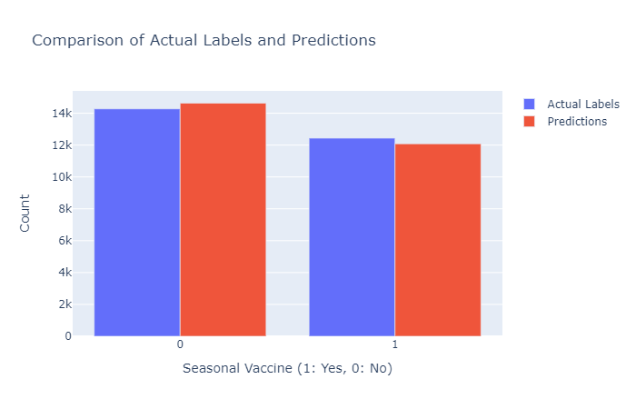

- From the plot above, we can see that our model is actually performing quite well in predicting both classes! With just some minor inaccuracy.

# Recommendations

1. Collaboration with healthcare and insurance providers: The Ministry of Health should work hand in hand with healthcare and insurance providers to increase the number of population covered by insurance. This will encourage individuals to undertake medical checkups as this will increase the consumption of information, i.e. getting a doctor's recommendation. This will therefore help in promoting and increasing seasonal flu vaccine uptake.

2. Identify High-Risk Groups: Utilize the predictive model to identify high-risk groups or populations that have historically shown low seasonal vaccine uptake. These high-risk groups include infants below 6 months, the elderly above 65 years, the medical/healthcare practitioners, and people with chronic medical conditions. This will help in promoting seasonal flu vaccine uptake.

3. Targeted Messaging and Outreach: Develop targeted communication strategies that address specific concerns. For example, debunking myths about the effects of vaccination, and how to maintain health practices that prevent spread of the flu. This will help in promoting seasonal flu vaccine awareness and uptake.

4. Effective Resource Allocation: The Ministry of Health should utilize the predictive model for effective allocation of resources such as human capital, funds, vaccines and other materials. For example, deploying human capital and more vaccines to areas with high vaccine-uptake, as opposed to deploying more vaccines to areas with low vaccine-uptake, as that will lead to wastages.

5. Policy-formulation: The Ministry of Health should prioritize policy development aimed at addressing public behavioral aspects regarding flu prevention measures, eg. wearing of face masks, minimizing large gatherings and regular washing of hands. Additionally, it should focus on ensuring widespread vaccination coverage among the population to effectively prevent the uncontrolled spread of the disease.

# Next Steps

1. Monitoring and Evaluation: Continuously monitor the impact of the interventions and communication strategies implemented. Evaluate the effectiveness of different approaches by comparing the vaccine uptake rates before and after the interventions.

2. Regularly update the predictive model with new data to refine targeting strategies and improve future interventions.